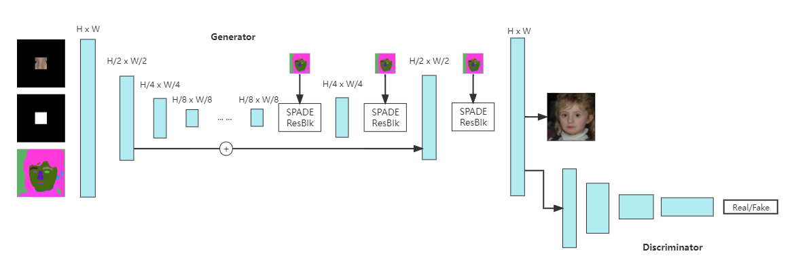
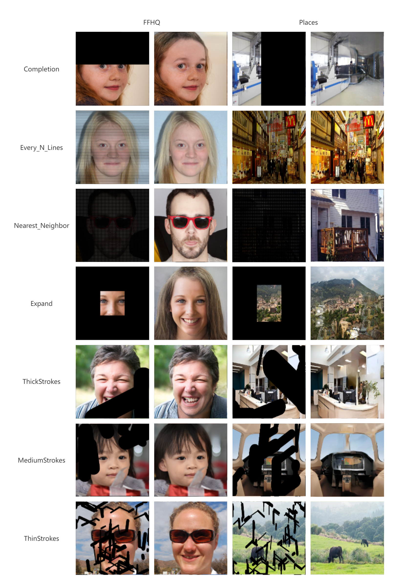

## Networks


## Installation
This code requires PyTorch 1.0 and python 3+. Please install dependencies by
```bash
pip install -r requirements.txt
```

This code also requires the Synchronized-BatchNorm-PyTorch rep.
```
cd models/networks/
git clone https://github.com/vacancy/Synchronized-BatchNorm-PyTorch
cp -rf Synchronized-BatchNorm-PyTorch/sync_batchnorm .
cd ../../
```

## Dataset Preparation
In the case of FFHQ and Places, we put a few sample images in this code repo, please see ./datasets/.

**Preparing FFHQ and Places Dataset**. 

FFHQ:
1. We download FFHQ dataset with the Kaggle command: kaggle datasets download -d rahulbhalley/ffhq-1024x1024
2. resize images into 512x512 and extract segmentation maps

Places:
1. we download Places with the link: http://data.csail.mit.edu/places/places365/train_large_places365challenge.tar
2. extract segmentation maps

## Training New Models

New models can be trained with the following commands.

To train on FFHQ
```bash
python train.py --name train_ffhq --dataset_mode custom --image /train/xinying/inpainting/FFHQ/image --label_dir /train/xinying/inpainting/FFHQ/seg --label_nc 19 --gpu 1 --nThreads 1 --batchSize 4 --netG spadepix2pixhd --no_instance --no_mask --no_flip 
``` 

To train on Places
``` 
python train.py --name train_place --dataset_mode custom --image /data/xinying/inpainting/place/data_large --label_dir /data/xinying/inpainting/place/seg --label_nc 182 --gpu  0 --nThreads 1 --batchSize 4 --netG spadepix2pixhd --no_instance --no_mask 
``` 

- Using `--name` to specify the folder to store training info
- Using `--label_nc` to specify the number of segmentation class
- Using `--image` to specify the image path
- Using `--label_dir` to specify the segmentation map path
- If you want to use the second and third GPUs for example, use `--gpu_ids 1,2`.
- In training stage, `--no_mask` should be specified, and the mask will be automatically generated.

## Test
1. Download pretrained model and put them in ./checkpoints.
https://drive.google.com/drive/folders/1az6lX_C-W-Au9dCzup-bKU0RXpL-iTb5?usp=sharing

2. Run test
To test on FFHQ
```bash
python test.py --dataset_mode custom --image /train/xinying/inpainting/test/FFHQ/test/ --label_dir /train/xinying/inpainting/test/FFHQ/test_seg --mask_dir /train/xinying/inpainting/test/FFHQ/test_mask --label_nc 19 --gpu 0 --batchSize 1 --netG spadepix2pixhd --no_instance --checkpoints_dir checkpoints --name train_ffhq
```
```bash
python test.py --dataset_mode custom --image /train/xinying/inpainting/val/FFHQ/val/ --label_dir /train/xinying/inpainting/val/FFHQ/val_seg --mask_dir /train/xinying/inpainting/val/FFHQ/val_mask --label_nc 19 --gpu 0 --batchSize 1 --netG spadepix2pixhd --no_instance --checkpoints_dir checkpoints --name train4
```

To test on Places
```bash
python test.py --dataset_mode custom --image /train/xinying/inpainting/test/Places/test/ --label_dir /train/xinying/inpainting/test/Places/test_seg --mask_dir /train/xinying/inpainting/test/Places/test_mask --label_nc 182 --gpu 0 --batchSize 1 --netG spadepix2pixhd --no_instance --checkpoints_dir checkpoints --name train_place
```
```bash
python test.py --dataset_mode custom --image /train/xinying/inpainting/val/Places/val/ --label_dir /train/xinying/inpainting/val/Places/val_seg --mask_dir /train/xinying/inpainting/val/Places/val_mask --label_nc 182 --gpu 0 --batchSize 1 --netG spadepix2pixhd --no_instance --checkpoints_dir checkpoints --name train_place0
```
- Using `--image` to specify the image path
- Using `--label_dir` to specify the segmentation map path
- Using `--mask_dir` to specify the binary mask path

The pretrain model of FFHQ

## Code Structure

- `train.py`, `test.py`: the entry point for training and testing.
- `trainers/pix2pix_trainer.py`: harnesses and reports the progress of training.
- `models/pix2pix_model.py`: creates the networks, and compute the losses
- `models/networks/`: defines the architecture of all models
- `options/`: creates option lists using `argparse` package. More individuals are dynamically added in other files as well. Please see the section below.
- `data/`: defines the class for loading images and label maps.

## Results



## Acknowledgments
This code borrows heavily from SPADE(https://github.com/NVlabs/SPADE)


